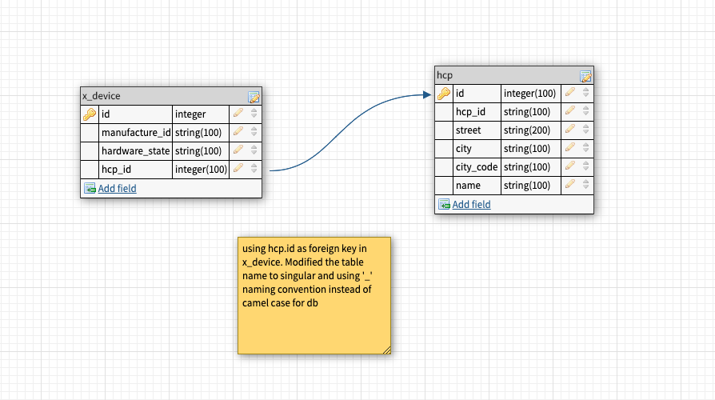

# S4DX Lab Inventory Service

Lab Inventory Service is a REST api built using Spring boot 2.2.4.RELEASE and Java 11.
 * [Rohit Naik] -Author 
 * [git-repo-url] - Source Code

# Features!

  - Endpoints to Save, Update, Delete XDevices
  - Endpoints to  Save, Update, Delete HCP Offices
  - Provide a list of all XDevices
  - Provide a list of HCP offices

### Tech

Lab Inventory Service uses a number of open source projects to work properly:

* [Spring Boot] - Spring Boot makes it easy to create stand-alone production ready applciations.
* [h2 Databse] - Very fast, open source in memory database.
* [Lombok] - is a java library that allows to avoid repetitive codes like getters and setter.
* [Swagger] - Swagger facilitates design, build, document and consume REST APIs.
* [Flyway] - Migration and Version control for the database.
* [Maven] - Project management and build.
* [Map Struct] - Code generator for mapping java beans.


### Plugins

The application uses the following plugins:

| Plugin | Description | 
| ------ | ------ |
| [PMD] | Source code analyzer. |
| [Spot bugs] | Static analysis to check bugs in Java code. |


### DB Design



### Running the application

This application requires [Java 11] to run.

From the command line 

```sh
$ cd lab-inventory-service
$ mvn install
$ java -jar target/lab-inventory-service-0.0.1-SNAPSHOT.jar
```

* By default, the application runs using application-dev.properties, exposed at port 8081. 
* The application Swagger UI can be accessed using http://localhost:8081/swagger-ui.html which provides API documentation as well.
* The database can be accessed using the url http://localhost:8081/h2/


 
  
   [git-repo-url]: <https://github.com/nrohitnaik/lab-inventory-service.git>
   [Rohit Naik]: <https://github.com/nrohitnaik>
   [spring boot]: <https://spring.io/projects/spring-boot>
   [Java 11]: <https://openjdk.java.net/projects/jdk/11/>
   [Lombok]: <https://projectlombok.org/>
   [Swagger]: <https://swagger.io/docs/specification/about/>
   [h2 Databse]: <https://www.h2database.com/html/main.html>
   [flyway]: <https://flywaydb.org/>
   [Maven]: <https://maven.apache.org/>
   [Map Struct]: <https://mapstruct.org/>
   [PMD]: <https://pmd.github.io/>
   [Spot Bugs]: <https://spotbugs.github.io/>
 

  
